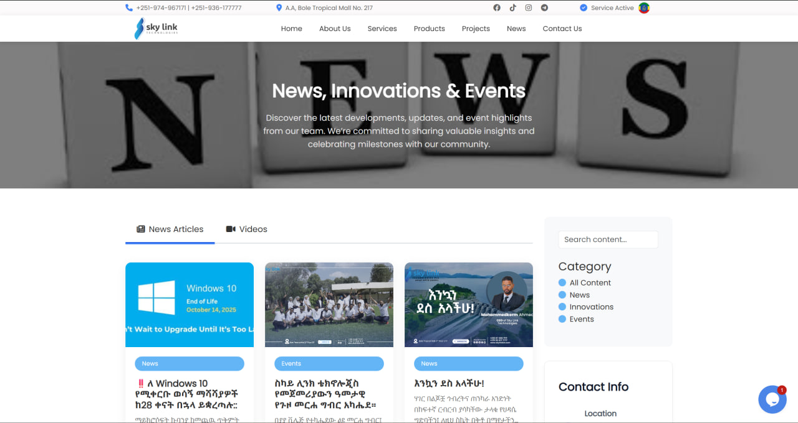
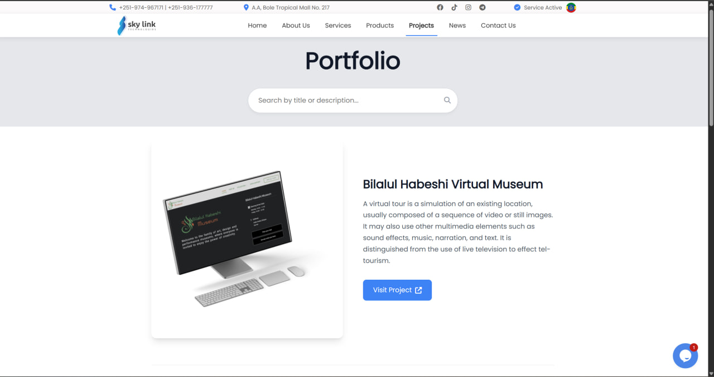
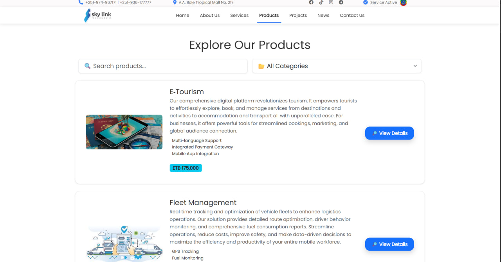
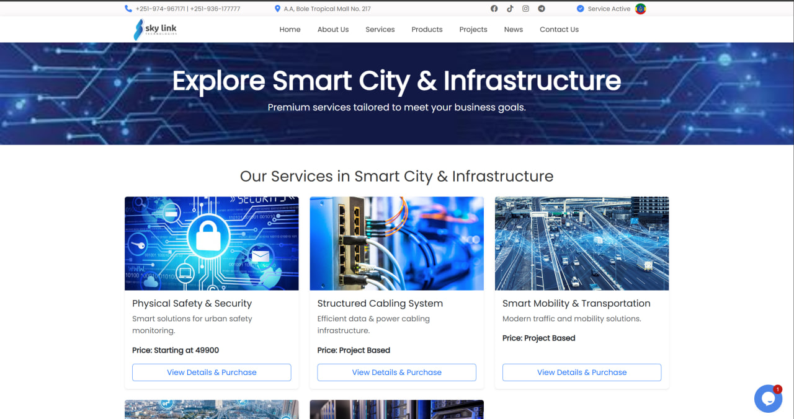

# Skylink Project

This is the official repository for the Skylink web application. It's a comprehensive platform built with Laravel 12, designed to showcase company services, display a portfolio of work, list products, and keep users updated with the latest news.


## ✨ Features

- **Services Management:** Create, update, and display various services offered by the company.
- **Portfolio Showcase:** A gallery to showcase completed projects with images and descriptions.
- **Product Catalog:** List and manage products.
- **News and Updates:** A blog/news section to publish articles and updates.
- **Contact and Messaging:** A contact form for user inquiries and a system to manage messages.
- **Newsletter Subscriptions:** Allows users to subscribe to a newsletter.

## 💻 Tech Stack

- **Backend:** [Laravel](https://laravel.com/) (^12.0)
- **Frontend:** [Tailwind CSS](https://tailwindcss.com/), [Alpine.js](https://alpinejs.dev/), [Vite](https://vitejs.dev/)
- **PHP Version:** ^8.2
- **Database:** MySQL / PostgreSQL (configurable in `.env`)
- **Authentication:** [Laravel Breeze](https://laravel.com/docs/starter-kits#laravel-breeze)

## 🚀 Getting Started

Follow these instructions to get a copy of the project up and running on your local machine for development and testing purposes.

### Prerequisites

Make sure you have the following software installed on your system:

- PHP >= 8.2
- [Composer](https://getcomposer.org/)
- [Node.js](https://nodejs.org/) & NPM
- A database server (e.g., MySQL, PostgreSQL)

### ⚙️ Installation

1.  **Clone the repository:**
    ```bash
    git clone https://github.com/your-username/Skylink-project.git
    cd Skylink-project
    ```

2.  **Install PHP dependencies:**
    ```bash
    composer install
    ```

3.  **Install JavaScript dependencies:**
    ```bash
    npm install
    ```

4.  **Set up the environment file:**
    ```bash
    cp .env.example .env
    ```

5.  **Generate the application key:**
    ```bash
    php artisan key:generate
    ```

6.  **Configure your database:**
    Open the `.env` file and update the `DB_*` variables with your database credentials.
    ```
    DB_CONNECTION=mysql
    DB_HOST=127.0.0.1
    DB_PORT=3306
    DB_DATABASE=skylink
    DB_USERNAME=root
    DB_PASSWORD=
    ```

7.  **Run database migrations:**
    This will create all the necessary tables in your database.
    ```bash
    php artisan migrate
    ```

8.  **(Optional) Seed the database:**
    This will populate the database with initial data.
    ```bash
    php artisan db:seed
    ```

### ▶️ Running the Application

You can run the development server, queue worker, and Vite bundler all at once with the custom `dev` script.

```bash
composer run dev
```

Alternatively, you can run the Laravel development server and Vite separately:

1.  **Start the Vite development server:**
    ```bash
    npm run dev
    ```

2.  **In a new terminal, start the Laravel server:**
    ```bash
    php artisan serve
    ```

The application will be available at `http://127.0.0.1:8000`.

## 🧪 Running Tests

To run the automated test suite for the application, use the following Artisan command:

```bash
composer run test
```
This will clear any cached configurations and then execute the PHPUnit tests.

## 📸 Screenshots

| News Section                               | Portfolio                                        |
| ------------------------------------------ | ------------------------------------------------ |
|  |  |

| Products                                     | Service                                        |
| -------------------------------------------- | ---------------------------------------------- |
|  |      |


## 🤝 Contributing

Contributions are what make the open-source community such an amazing place to learn, inspire, and create. Any contributions you make are **greatly appreciated**.

If you have a suggestion that would make this better, please fork the repo and create a pull request. You can also simply open an issue with the tag "enhancement".

1.  Fork the Project
2.  Create your Feature Branch (`git checkout -b feature/AmazingFeature`)
3.  Commit your Changes (`git commit -m 'Add some AmazingFeature'`)
4.  Push to the Branch (`git push origin feature/AmazingFeature`)
5.  Open a Pull Request

## 📄 License

This project is licensed under the MIT License. See the `LICENSE` file for details.
